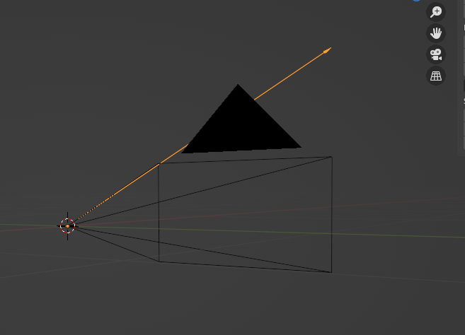
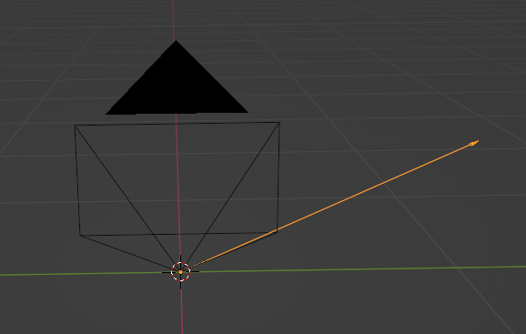
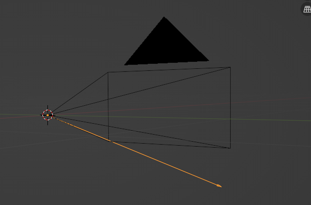
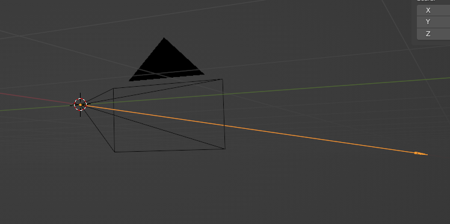

# 3D Path tracking using point triangulation

-------

# Table of contents

1. [Requirements](#requirements)
2. [How to use](#how-to-use)
3. [How it works](#how-it-works)
5. [Examples](#examples) TODO

-----

### Requirements <a name="requirements"></a>

- Linux (tested on Ubuntu 20.04 LTS)

- g++ compiler
```bash
sudo apt intall g++
```

- CMake
```bash
sudo snap install cmake
```

Installed opencv, follow this tutorial: (https://www.geeksforgeeks.org/how-to-install-opencv-in-c-on-linux/)

### How to use <a name="how-to-use"></a>

Program takes in as input XML file with camera's data (their's extrinsic and intrinsic parameters) and seperate CSV file for every camera. Each row in this input file corresponds to coordinatates (x1, y1, x2, y2) of bounding box.

- Camera's file
For camera's XML file it creates vector of custom objects that hold camera's information. Note that this vector contain only valid cameras (go to the last four cameras objects in `cameras.xml` file to see valid structure). Every camera has it's ID (it is required that camera's positions in XML file are sorted `ascending` by their's ID's). Note that orientation of camera is a rotation quaternion passed as `(i, j, k, w)`.

- Detection's file
For every CSV file we first check to which camera this file is corelelated. Remeber to place CSV files in the same folder and have them in the same order as camera's object's in XML file (Give your cameras some ID's and use corresponding ID's in the name of CSV files). After processing all of the CSV files 2D vector of `cv::Point2d` is created `(n_cams, n_points)`, first dimention corresponds to number of cameras and second dimention corresponds to number of points. Remeber that number of rows in all of the CSV files must be equal. If object isn't detected on frame just pass it as empty row with ID. Each entry in this vector corresponds to pixel coordinates of the center of the bounding box. See CSV files in `referenceBB` folder to see correct structure.

- Output file
Program creates `output.ply` file which contains all of the triangulated points, open it in blender to see the path.

When you have these files in place run

```bash
cmake . & make
```

This will create output binary file `main`, run it by:

```bash
./main cameras.xml ./referenceBB
```


### How it works <a name="how-it-works"></a>

After parsing input files we create `PointTriangulator` which takes in vector of cameras.
We than call `triangulatePoints` method which takes in 2D vector of points and returns 1D vector of triangulated 3D points.

In `triangulatePoints` we first check correctness of passed 2D vector of points and than extract set of 2D points for each frame.

Then for every point `Ray` is created. Ray is simply a half line in 3D space. It starts in the same position as it's camera and it's orientation is orientation of camera adjusted to point's pixel coordinates. This ray represent possible 3D positions of this pixel in space.

To get ray's direction `pixel ray` is calculated. Here are a few examples of `pixel rays` that will be created for different pixel coordinates (for simplicity camera's image size is `[640, 480]`):

Pixel coordinates: `[0,0]`:



Pixel coordinates: `[639,0]`:


Pixel coordinates: `[639,479]`:



Pixel coordinates: `[0,479]`:



Pixel coordinates: `[320, 240]`:




In our case `test camera` (test camera means hypothetical camera used to generate `pixel rays`, it doesn't include real camera orientation) is looking along positive `x axis`, it's because `identity quaternion` is also looking along positive `x axis`.

So `pixel ray` doesn't include camera's rotation, to include camera's rotation we just simply rotate `pixel ray` by camera's orientation quaternion. After this operation we have successfully calculated `ray` for detected bounding box.

If there was no boundig box for some camera in some frame then we simply don't generate a ray.

The last step is finding 3D point that is closest to generated set of rays. Opencv's `LMSolver` is used for this task.
Custom `compute` function is implemented, it calculates error and jacobian matrix in current iteration of solver.
Jacobian matrix is calculated using estimated partial derivatives so some kind of threshold is required. If triangulation doesn't work try playing with this threshold (It is defined as macro on top of `PointTriangulator.h` file). 

After calculating 3D point for each frame, vector of those points is returned.


