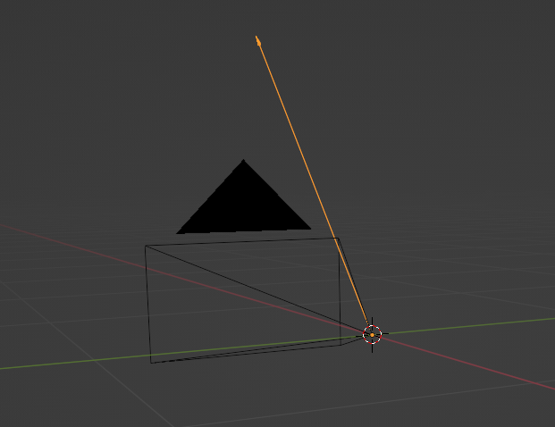

# 3D Path tracking using point triangulation

-------

# Table of contents

1. [Requirements](#requirements)
2. [How to use](#how-to-use)
3. [How it works](#how-it-works)
4. [Testing](#testing)
5. [Results](#results)

-----

### Requirements <a name="requirements"></a>

- Linux (tested on Ubuntu 20.04 LTS)

- g++ compiler
```bash
sudo apt intall g++
```

- CMake
```bash
sudo snap install cmake
```

Installed opencv, follow this tutorial: (https://www.geeksforgeeks.org/how-to-install-opencv-in-c-on-linux/)

### How to use <a name="how-to-use"></a>

Program takes in as input XML file with camera's data (their's extrinsic and intrinsic parameters) and seperate CSV file for every camera. Each row in this input file corresponds to coordinatates (x1, y1, x2, y2) of bounding box.

- Camera's file
For camera's XML file it creates vector of custom objects that hold camera's information. Note that this vector contain only valid cameras (go to the last four cameras objects in `cameras.xml` file to see valid structure). Every camera has it's ID (it is required that camera's positions in XML file are sorted `ascending` by their's ID's). Note that orientation of camera is a rotation quaternion passed as `(i, j, k, w)` and identity quaternion lays on positive `z axis`. Note that you may have to invert rotation quaternion to make it a orientation quaternion. In that case pass it as `(-i, -j, -k, w)`.

- Detection's file
For every CSV file we first check to which camera this file is corelelated. Remeber to place CSV files in the same folder and have them in the same order as camera's object's in XML file (Give your cameras some ID's and use corresponding ID's in the name of CSV files). CSV file's structure can be different for one drone and multiple drones. See `data_one_drone/referenceBB` folder to see the structure for one drone and `Dron1Dron2LotDowolny/referenceBB` to see the structure for multiple drones. Reading these files can be modifies by adjusting parameters from `loadPointsOneDrone` or `loadPointsMultipleDrones` functions in `main.cpp`. You can also write your own parse function adjusted to your's CSV format.

- Output file
Program creates `.ply` file which contains all of the triangulated points for each drone, open it in blender to see the path. For example if you run it on data with 3 drones, 3 files will be created: `dron1.ply`, `dron2.ply`, `dron3.ply`.

When you have these files in place run

```bash
cmake . & make
```

This will create output binary file `main`, run it by:

```bash
./main ./data_one_drone/cameras.xml ./data_one_drone/referenceBB
```

or

```bash
./main ./data_one_drone/cameras.xml ./data_one_drone/referenceBB
```

There are some additional arguments:

#### `--n_drones`:
When running this algorithm for multiple drones on scene you must specify the number of drones in this argument.

`./main ./Dron1Dron2LotDowolny/cameras.xml ./Dron1Dron2LotDowolny/referenceBB/ --n_drones 2`

#### `--triangulator`:
You can choose between two methods of triangulation:

 - ##### `MatrixTriangulator`:
It is the default method. It triangulates points with help of matrices. It is faster are generally more accurate than `RayTriangulator`.
If you want to use it, don't specify `--triangulator` argument or use `--triangulator matrix`.

 - ##### `RayTriangulator`:
It is slower and little bit less accurate but it can be heavily modified. It uses openCV's `LMSolver` to triangulate points. Use it with `--triangulator ray`.

### How it works <a name="how-it-works"></a>

After parsing input files we create `PointTriangulator` which takes in vector of cameras.
We than call `triangulatePoints` method which takes in 2D vector of points and returns 1D vector of triangulated 3D points.

In `triangulatePoints` we first check correctness of passed 2D vector of points and than extract set of 2D points for each frame.

Then for every point `Ray` is created. Ray is simply a half line in 3D space. It starts in the same position as it's camera and it's orientation is orientation of camera adjusted to point's pixel coordinates. This ray represent possible 3D positions of this pixel in space.

To get ray's direction `pixel ray` is calculated. Here are a few examples of `pixel rays` that will be created for different pixel coordinates (for simplicity camera's image size is `[640, 480]`):

Pixel coordinates: `[0,0]`:


Pixel coordinates: `[639,0]`:



Pixel coordinates: `[639,479]`:


Pixel coordinates: `[0,479]`:


Pixel coordinates: `[320, 240]`:


In our case `test camera` (test camera means hypothetical camera used to generate `pixel rays`, it doesn't include real camera orientation) is looking along positive `x axis`, it's because `identity quaternion` is also looking along positive `x axis`.

So `pixel ray` doesn't include camera's rotation, to include camera's rotation we just simply rotate `pixel ray` by camera's orientation quaternion. After this operation we have successfully calculated `ray` for detected bounding box.

If there was no boundig box for some camera in some frame then we simply don't generate a ray.

The last step is finding 3D point that is closest to generated set of rays. Opencv's `LMSolver` is used for this task.
Custom `compute` function is implemented, it calculates error and jacobian matrix in current iteration of solver.
Jacobian matrix is calculated using estimated partial derivatives so some kind of threshold is required. If triangulation doesn't work try playing with this threshold (It is defined as macro on top of `PointTriangulator.h` file). 

After calculating 3D point for each frame, vector of those points is returned.

### Testing <a name="testing"></a>

To test the algorithm a CSV file for true drone 3D positions is required. In my case label data is collected from Vicon which is 3D tracking system. There are 4 markers on each drone, then center of cross is calculated which is then offset by some vector to be in the visual center of the drone. Output error is in the same units as camera's positions in `.xml` file. For example is we pass cameras positions in `cm` these errors will also be in `cm`.

To test the results run this command:

```bash
./test output.ply ./data_one_drone/labels.csv
```

There are a few parameters:

- `--frequency`:
    System vicon has higher frequency than cameras so that's why there is a `--frequency` parameter.
    
    ```bash
    ./test drone2.ply ./Dron1Dron2LotDowolny/Dron2_label.csv --frequency 4
    ```    

    This means that every fourth row will be read from CSV file.

- `--output`:
    You can save CSV file in `.ply` file that can be also visualized in blender.

    ```bash
    ./test drone1.ply ./Dron1Dron2LotDowolny/Dron1_label.csv --output label.ply
    ```   

    This will create a `label.ply` file with label path of the drone.

Note that if you want to test every drone on the recording you must run test script for every drone seperatly.


### Results <a name="results"></a>

 - Here is a result video for one drone:

    https://github.com/Grzetan/3D-Reconstruction-Triangulation/assets/52281852/e778cb4b-dd2c-4a40-9415-08f4d592b6a3

    Red path is a label path from Vicon system and blue path is predicted path.
    
    For this recording average erros is about 2 cm.


 - Here is a visualization for two drones:

    https://github.com/Grzetan/3D-Reconstruction-Triangulation/assets/52281852/b3cb6896-328b-48a1-aadc-ef6daa042d7e

    Darker path means label path from vicon and light path is detected path.
    
    For the red drone error is about 9 cm and for blue drone 13 cm.
